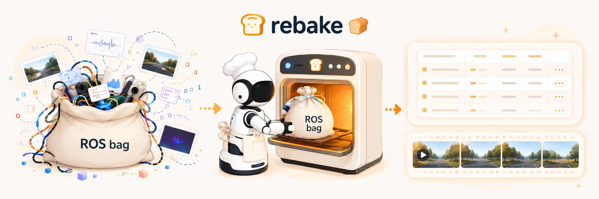

<!-- This file mirrors README.md. English is canonical. -->
[English](README.md) | **日本語**

<p align="center">
  
</p>

<p align="center">
  <b>ROS bag を一度デコードすれば、あとはデータベースのようにクエリし、何度でも LeRobot 学習データへと焼き上げられます。</b>
</p>

<p align="center">
  <a href="LICENSE"></a>
  
  
</p>

rebake は ROS bag（`.bag` / `.mcap`）を、クエリ可能な **Parquet ＋ 動画** のデータセットに、さらにそこから [LeRobot v2.1](https://github.com/huggingface/lerobot) 学習データへと変換します。CLI・Python パッケージ・Rust ライブラリとして使えます。

---

## なぜ rebake なのか

ROS bag は *記録* のための形式であって、*活用* のための形式ではありません。サイズが大きく、読み込みが遅く、メッセージ単位で直列化されているため、分析や学習のたびに ROS bag を再パースし、TF ツリーを組み直し、そろっていないクロックを合わせ直すところから始まります。LeRobot のような学習形式は読み込みの問題こそ解決しますが、設計上「非可逆」です。どのトピック・どのレート・どの特徴量を使うかという選択を焼き込んでしまうため、考えを変えるたびに ROS bag からやり直すことになります。

rebake は ROS bag を **一度だけ** デコードして、クエリ可能な Parquet ＋ 動画の中間フォーマットに変換します。同期・座標変換・LeRobot 出力といった処理は、すべてその中間フォーマットの *上で* 走ります。

- ⚡ **デシリアライズせずにクエリ。** 各トピックは列指向の Parquet テーブルになるので、メッセージ全体ではなく必要な列だけを、DuckDB・Polars・pandas から直接読めます。
- 📦 **小さく、アーカイブにも。** 列ごとの圧縮とカメラ映像の動画化により、中間フォーマットは元の ROS bag の 7〜10 分の 1 ほどのサイズになります（状態データは無損失のまま）。一時ファイルではなく、長期保存できるアーカイブです。
- 🧱 **型と構造を保持。** ネストした ROS メッセージは、構造と型を保ったまま Parquet の構造体になります。メッセージ定義が変わるたびに書き直していた壊れやすいパースコードが、要らなくなります。
- 🌍 **データのエコシステムにそのまま乗る。** Parquet と動画は、DuckDB・Polars・pandas・Arrow・Spark・FFmpeg など、どこでもそのまま扱える標準フォーマットです。ロボットのデータがチームの既存ツールに直接流れ込み、rebake 専用のものを入れる必要はありません。

重い処理が中間フォーマットに集約されているので、トピックやサンプルレートを変えて再キュレーションしても、ROS bag を読み直すことはありません。そして LeRobot v2.1 は、このパイプラインが書き出せる最初の出力先にすぎません。

## クイックスタート

> [!NOTE]
> 各 ROS bag には小さな `meta.json` サイドカー（データセット ID と、フルパイプライン用のセグメントラベル）が必要です。同梱の設定ファイルはこれを前提にしています。詳しくは [docs/configuration_ja.md](docs/configuration_ja.md#metadata-requirement) を参照してください。

開発用コンテナでビルドします:

```bash
git clone --recursive https://github.com/airoa-org/rebake.git
cd rebake
docker compose -f docker/docker-compose.yml up -d --build
docker compose -f docker/docker-compose.yml exec rebake-dev bash

# inside the container
just build      # → ./target/release/rebake-cli
```

**ROS bag をクエリ可能な中間フォーマットにデコード。** 1 つの `.bag` / `.mcap` でも、それらをまとめたディレクトリでも指定できます。`-j` を付ければ、各 ROS bag をそれぞれ独立したプロセスで並列に変換します:

```bash
rebake-cli export ./bags -o ./out -j 8
```

不透明だった ROS bag が、ただの Parquet と動画になりました。rebake がなくても、好きなツールで中身を見られます:

```python
import pandas as pd
pd.read_parquet("out/<id>/parquet/joint_states.parquet")   # also: polars, pyarrow
```
```bash
duckdb -c "SELECT * FROM 'out/*/parquet/joint_states.parquet' LIMIT 5"
```

**学習の準備ができたら、LeRobot v2.1 データセットを焼き上げます。** 1 つの宣言的なパイプラインで、ロボットごとのコードは不要。`export` と同じく、ディレクトリをまとめて並列に処理できます:

```bash
rebake-cli run ./bags -c config/pipeline/yubi.yaml -j 8
```
```text
lerobot_dataset/
├── meta/      info.json, episodes.jsonl, tasks.jsonl, episodes_stats.jsonl
├── data/      エピソードごとに 1 つの Parquet
└── videos/    カメラごと・エピソードごとに 1 つの動画
```

標準的な LeRobot v2.1 データセットなので、そのまま `lerobot` ライブラリで読み込んで学習を始められます。トピック・同期レート・特徴量マッピングを変えて再キュレーションするときは、中間フォーマットを入力にして再実行すれば、rebake はそれを再取り込みするので、元の ROS bag を読み直す必要はありません。

## 仕組み

パイプラインは、**コンテキスト**を共有する**ステージ**の宣言的なリストです。YAML 上でステージの並べ替え・追加・削除ができ、コードの変更は必要ありません。

```yaml
# config/pipeline/yubi.yaml を簡略化
stage_configs:
  - Rosbag2IngestorConfig: {}             # .bag / .mcap を読む
  - TfBufferEnricherConfig: {}            # TF ツリーを構築
  - TfChainEnricherConfig:                # フレーム間の姿勢を計算
      frame_pairs:
        - source: quest_origin
          target: quest_hmd
  - ZeroOrderHoldTimeSynchronizerConfig:  # 1 つのタイムラインに再サンプリング
      fps: 30
  - LeRobotV21TransformerConfig:          # LeRobot データセットを書き出す
      robot_model: ./config/robot_model/yubi.yaml
```

- **Synchronize** — 異なるレートで記録されたトピックを 1 つのタイムラインに再サンプリングし（ゼロ次ホールド / 最近傍 / タイムスタンプマージ）、各行に `is_fresh` を付けて、保持された値を実測値と取り違えないようにします。
- **Enrich** — `/tf`・`/tf_static` から TF ツリーを構築し、順運動学（SE(3) 合成・最小共通祖先探索）で任意の 2 フレーム間のエンドエフェクタやカメラの姿勢を計算します。さらに行動ラベルも生成します。いずれも、方策の学習に必要なのに ROS bag には直接記録されていない情報です。
- **Encode** — カメラ映像を AV1/H.264/H.265 に符号化します。深度は 16bit のミリメートル値を 8bit RGB に潰さず、可逆 FFV1 やコンパクトな 10bit 形式で正確に保ちます。

<details>
<summary><b>全ステージ一覧</b></summary>

Ingest（ROS 1/2、または rebake 中間フォーマットの再取り込み）· Synchronize（ZOH / 最近傍 / タイムスタンプマージ）· Enrich（TF バッファ＆チェーン、関節・座標変換の差分、action shift、uuid）· Encode（RGB・深度の動画、ソフトウェアまたは VA-API/NVENC）· Export（Parquet + 動画の中間フォーマット）· Transform（LeRobot v2.1）· Merge（再エンコードせずにデータセットを統合）。詳細は [docs/configuration_ja.md](docs/configuration_ja.md)。
</details>

## 自分のロボットに対応させる

新しいロボットへの対応は YAML 1 枚です。ROS のトピックとフィールド（JSON Pointer）を LeRobot の特徴量に対応づけます。

```yaml
# robot_model.yaml
- type: Parquet
  topic: /joint_states
  field: /position
  feature: observation.state
- type: Video
  topic: /camera/color/image_raw/compressed
  feature: observation.image.head
- type: Parquet
  topic: /right_hand/command
  field: /position
  feature: action.right_hand
- type: Parquet
  topic: /left_hand/command
  field: /position
  feature: action.left_hand
```

完全な例は [config/robot_model/](config/robot_model/) を参照してください。

## Python

同じステージを Python から。[maturin](https://github.com/PyO3/maturin) でソースからビルドし、Arrow/PyArrow とゼロコピーでやり取りします。各ステージは `Config().build().run(context)` で、そのまま LeRobot データセットの生成まで通せます。

```python
from rebake.core import Context
from rebake.encode import VideoEncoderConfig
from rebake.enrich import FramePair, TfBufferEnricherConfig, TfChainEnricherConfig
from rebake.ingest import Rosbag2IngestorConfig
from rebake.synchronize import ZeroOrderHoldTimeSynchronizerConfig
from rebake.transform import LeRobotV21TransformerConfig

context = Context()
context.set_rosbag_path("recording.mcap")
context = Rosbag2IngestorConfig().build().run(context)
context = TfBufferEnricherConfig().build().run(context)
context = TfChainEnricherConfig(
    frame_pairs=[FramePair(source="quest_origin", target="quest_hmd")],
).build().run(context)
context = ZeroOrderHoldTimeSynchronizerConfig(fps=10).build().run(context)
context = LeRobotV21TransformerConfig(
    outdir="./lerobot_dataset",
    robot_model="config/robot_model/yubi.yaml",
    video_config=VideoEncoderConfig(fps=10),
).build().run(context)
```

完全な API と例は [python/](python/) を参照してください。

## 詳しく

- **[CLI](docs/cli_ja.md)** — `run`・`export`・`merge`
- **[設定](docs/configuration_ja.md)** — パイプライン、ロボットモデル、符号化
- **[ハードウェアアクセラレーション](docs/hardware_ja.md)** — VA-API と NVENC
- **[変更履歴](CHANGELOG.md)** — 本リリースの内容（rebake は 1.0 未満。変更が入り得ます）

## コントリビュート

Issue や Pull Request を歓迎します。[CONTRIBUTING.md](CONTRIBUTING.md) を読み、[Discussions](https://github.com/airoa-org/rebake/discussions) で気軽に声をかけてください。

## License

Apache License, Version 2.0 のもとで公開されています。詳細は [LICENSE](LICENSE) を参照してください。

Copyright © 2026 AI Robot Association.
